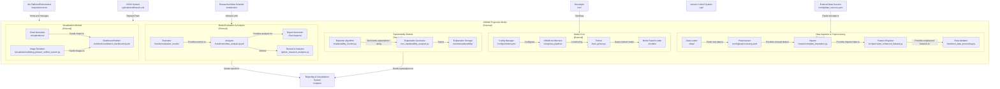

# Unnamed CodeViz Diagram

```mermaid
graph TD

    researcher["Researcher/Data Scientist<br>/notebooks/"]
    developer["Developer<br>/src/"]
    data_sources["External Data Sources<br>/config/data_sources.yaml"]
    ml_platform["ML Platform/Environment<br>/requirements.txt"]
    version_control["Version Control System<br>/.git/"]
    ci_cd["CI/CD System<br>/.github/workflows/ci.yml"]
    reporting_viz["Reporting & Visualization System<br>/outputs/"]
    subgraph giman_model_boundary["GIMAN Prognostic Model<br>[External]"]
        subgraph data_ingestion_boundary["Data Ingestion & Preprocessing<br>[External]"]
            data_loader["Data Loader<br>/data/"]
            preprocessor["Preprocessor<br>/config/preprocessing.yaml"]
            imputer["Imputer<br>/scripts/complete_imputation.py"]
            feature_engineer["Feature Engineer<br>/scripts/create_enhanced_dataset.py"]
            data_validator["Data Validator<br>/tests/test_data_processing.py"]
            %% Edges at this level (grouped by source)
            data_loader["Data Loader<br>/data/"] -->|"Feeds raw data to"| preprocessor["Preprocessor<br>/config/preprocessing.yaml"]
            preprocessor["Preprocessor<br>/config/preprocessing.yaml"] -->|"Provides cleaned data to"| imputer["Imputer<br>/scripts/complete_imputation.py"]
            imputer["Imputer<br>/scripts/complete_imputation.py"] -->|"Provides imputed data to"| feature_engineer["Feature Engineer<br>/scripts/create_enhanced_dataset.py"]
            feature_engineer["Feature Engineer<br>/scripts/create_enhanced_dataset.py"] -->|"Provides engineered features to"| data_validator["Data Validator<br>/tests/test_data_processing.py"]
        end
        subgraph model_core_boundary["Model Core<br>[External]"]
            config_manager["Config Manager<br>/configs/model.yaml"]
            giman_architecture["GIMAN Architecture<br>/src/giman_pipeline/"]
            trainer["Trainer<br>/train_giman.py"]
            model_saver_loader["Model Saver/Loader<br>/models/"]
            %% Edges at this level (grouped by source)
            config_manager["Config Manager<br>/configs/model.yaml"] -->|"Configures"| giman_architecture["GIMAN Architecture<br>/src/giman_pipeline/"]
            giman_architecture["GIMAN Architecture<br>/src/giman_pipeline/"] -->|"Is trained by"| trainer["Trainer<br>/train_giman.py"]
            trainer["Trainer<br>/train_giman.py"] -->|"Saves trained model"| model_saver_loader["Model Saver/Loader<br>/models/"]
        end
        subgraph model_evaluation_boundary["Model Evaluation & Analysis<br>[External]"]
            evaluator["Evaluator<br>/results/evaluation_results/"]
            analyzer["Analyzer<br>/notebooks/data_analysis.ipynb"]
            report_generator["Report Generator<br>/Docs/reports/"]
            research_analytics["Research Analytics<br>/giman_research_analytics.py"]
            %% Edges at this level (grouped by source)
            evaluator["Evaluator<br>/results/evaluation_results/"] -->|"Provides metrics to"| analyzer["Analyzer<br>/notebooks/data_analysis.ipynb"]
            analyzer["Analyzer<br>/notebooks/data_analysis.ipynb"] -->|"Provides analysis for"| report_generator["Report Generator<br>/Docs/reports/"]
            analyzer["Analyzer<br>/notebooks/data_analysis.ipynb"] -->|"Informs"| research_analytics["Research Analytics<br>/giman_research_analytics.py"]
        end
        subgraph explainability_module_boundary["Explainability Module<br>[External]"]
            explainer_algorithm["Explainer Algorithm<br>/explainability_Gemini.py"]
            explanation_generator["Explanation Generator<br>/run_explainability_analysis.py"]
            explanation_storage["Explanation Storage<br>/results/explainability/"]
            %% Edges at this level (grouped by source)
            explainer_algorithm["Explainer Algorithm<br>/explainability_Gemini.py"] -->|"Generates explanations using"| explanation_generator["Explanation Generator<br>/run_explainability_analysis.py"]
            explanation_generator["Explanation Generator<br>/run_explainability_analysis.py"] -->|"Stores"| explanation_storage["Explanation Storage<br>/results/explainability/"]
        end
        subgraph visualization_module_boundary["Visualization Module<br>[External]"]
            chart_generator["Chart Generator<br>/visualizations/"]
            dashboard_builder["Dashboard Builder<br>/notebooks/validation_dashboard.ipynb"]
            image_renderer["Image Renderer<br>/visualizations/debug_phase4_unified_system.py"]
            %% Edges at this level (grouped by source)
            chart_generator["Chart Generator<br>/visualizations/"] -->|"Feeds charts to"| dashboard_builder["Dashboard Builder<br>/notebooks/validation_dashboard.ipynb"]
            image_renderer["Image Renderer<br>/visualizations/debug_phase4_unified_system.py"] -->|"Feeds images to"| dashboard_builder["Dashboard Builder<br>/notebooks/validation_dashboard.ipynb"]
        end
    end
    %% Edges at this level (grouped by source)
    researcher["Researcher/Data Scientist<br>/notebooks/"] -->|"Interacts with"| model_evaluation_boundary["Model Evaluation & Analysis<br>[External]"]
    developer["Developer<br>/src/"] -->|"Develops"| model_core_boundary["Model Core<br>[External]"]
    data_sources["External Data Sources<br>/config/data_sources.yaml"] -->|"Feeds raw data to"| data_ingestion_boundary["Data Ingestion & Preprocessing<br>[External]"]
    model_evaluation_boundary["Model Evaluation & Analysis<br>[External]"] -->|"Sends reports to"| reporting_viz["Reporting & Visualization System<br>/outputs/"]
    explainability_module_boundary["Explainability Module<br>[External]"] -->|"Sends explanations to"| reporting_viz["Reporting & Visualization System<br>/outputs/"]
    ml_platform["ML Platform/Environment<br>/requirements.txt"] -->|"Hosts and manages"| giman_model_boundary["GIMAN Prognostic Model<br>[External]"]
    ci_cd["CI/CD System<br>/.github/workflows/ci.yml"] -->|"Deploys/Tests"| giman_model_boundary["GIMAN Prognostic Model<br>[External]"]

```
---
*Generated by [CodeViz.ai](https://codeviz.ai) on 9/26/2025, 2:15:40 PM*
