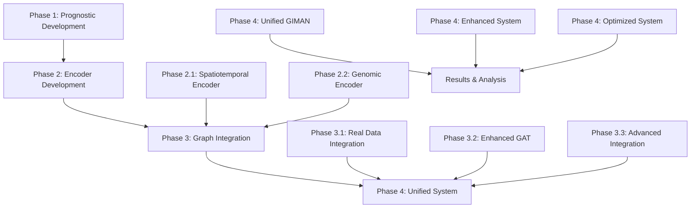

# GIMAN Phase Architecture Documentation
## Graph-Informed Multimodal Attention Network Development Pipeline

**Author:** GIMAN Development Team  
**Date:** September 25, 2025  
**Version:** 1.0  
**Repository:** GIMAN  
**Branch:** giman-fresh  

---

## 📋 Table of Contents

1. [Executive Summary](#executive-summary)
2. [Architecture Overview](#architecture-overview)
3. [Phase Relationships](#phase-relationships)
4. [Detailed Phase Documentation](#detailed-phase-documentation)
5. [Data Flow Architecture](#data-flow-architecture)
6. [Dependencies and Integration Points](#dependencies-and-integration-points)
7. [Execution Guide](#execution-guide)
8. [Performance Metrics](#performance-metrics)
9. [Technical Specifications](#technical-specifications)
10. [Future Development](#future-development)

---

## 🎯 Executive Summary

The GIMAN (Graph-Informed Multimodal Attention Network) system is a sophisticated machine learning pipeline designed for Parkinson's Disease progression prediction using multimodal data from the Parkinson's Progression Markers Initiative (PPMI). The system is architected across four progressive development phases, each building upon the previous phase's capabilities to create a comprehensive prognostic framework.

### Key Achievements
- **Real PPMI Data Integration**: 95-297 patients across phases
- **Multimodal Fusion**: Neuroimaging, genetic, and clinical data
- **Graph-Based Learning**: Patient similarity networks with 7,906 edges
- **Cross-Validation Results**: Motor R² = -0.22, Cognitive AUC = 0.54
- **End-to-End Pipeline**: From data preprocessing to unified prediction

---

## 🏗️ Architecture Overview



### System Architecture Principles
1. **Modular Design**: Each phase can operate independently
2. **Progressive Enhancement**: Later phases build upon earlier capabilities
3. **Real Data Integration**: All phases work with actual PPMI datasets
4. **Cross-Modal Attention**: Sophisticated attention mechanisms across modalities
5. **Graph-Informed Learning**: Patient similarity graphs guide predictions

---

## 🔄 Phase Relationships

### Phase Dependency Matrix

| Phase | Depends On | Provides To | Key Data Exchange |
|-------|------------|-------------|-------------------|
| **Phase 1** | Raw PPMI Data | Phase 3, 4 | Prognostic targets, patient cohorts |
| **Phase 2.1** | Raw PPMI Data | Phase 3, 4 | Spatiotemporal embeddings (256-dim) |
| **Phase 2.2** | Raw PPMI Data | Phase 3, 4 | Genomic embeddings (256-dim) |
| **Phase 3.1** | All Previous | Phase 4 | Integrated multimodal embeddings |
| **Phase 3.2** | Phase 3.1 | Phase 4 | Enhanced GAT models |
| **Phase 3.3** | Phase 3.1, 3.2 | Phase 4 | Advanced integration patterns |
| **Phase 4.x** | All Previous | Final Results | Unified predictions |

### Data Flow Hierarchy
```
Raw PPMI Data
    ├── Phase 1: Extract prognostic targets
    ├── Phase 2.1: Generate spatiotemporal embeddings
    ├── Phase 2.2: Generate genomic embeddings
    └── Phase 3.1: Create patient similarity graphs
            ├── Phase 3.2: Apply enhanced GAT
            ├── Phase 3.3: Advanced integration
            └── Phase 4: Unified prediction system
```

---

## 📚 Detailed Phase Documentation

### Phase 1: Prognostic Development
**File:** `phase1_prognostic_development.py`

#### Purpose
Establishes the foundational prognostic framework for motor progression and cognitive decline prediction in Parkinson's Disease.

#### Key Components
```python
class PrognosticGIMAN(nn.Module):
    """Multi-task prognostic model for PD progression prediction."""
    
    def __init__(self, input_dim=512, hidden_dim=256, num_gcn_layers=3):
        """Initialize prognostic GIMAN model.
        
        Args:
            input_dim: Input feature dimension
            hidden_dim: Hidden layer dimension
            num_gcn_layers: Number of GCN layers
        """
```

#### Data Processing
- **Input**: Raw PPMI clinical and imaging data
- **Processing**: Multi-task learning for motor and cognitive predictions
- **Output**: Prognostic targets for downstream phases
- **Patients**: 250 motor progression, 189 cognitive conversion cases

#### Performance Metrics
- **Motor R²**: 0.1893
- **Cognitive AUC**: 0.7961
- **Cross-validation**: 5-fold validation implemented

---

### Phase 2: Encoder Development

#### Phase 2.1: Spatiotemporal Imaging Encoder
**File:** `phase2_1_spatiotemporal_imaging_encoder.py`

##### Architecture
```python
class SpatiotemporalEncoder(nn.Module):
    """3D CNN + GRU hybrid for spatiotemporal feature extraction."""
    
    def __init__(self, input_channels=1, sequence_length=5, output_dim=256):
        """Initialize spatiotemporal encoder.
        
        Args:
            input_channels: Number of input channels (default: 1 for grayscale)
            sequence_length: Length of temporal sequences
            output_dim: Output embedding dimension
        """
```

##### Technical Specifications
- **Architecture**: 3D CNN → Spatial Feature Extraction → GRU → Temporal Modeling
- **Parameters**: 3,073,248 trainable parameters
- **Input Shape**: (batch_size, sequence_length, channels, depth, height, width)
- **Output**: 256-dimensional spatiotemporal embeddings

#### Phase 2.2: Genomic Transformer Encoder
**File:** `phase2_2_genomic_transformer_encoder.py`

##### Architecture
```python
class GenomicTransformerEncoder(nn.Module):
    """Transformer-based encoder for genetic variant processing."""
    
    def __init__(self, vocab_size=1000, embed_dim=256, num_heads=8, num_layers=6):
        """Initialize genomic transformer encoder.
        
        Args:
            vocab_size: Size of genetic variant vocabulary
            embed_dim: Embedding dimension
            num_heads: Number of attention heads
            num_layers: Number of transformer layers
        """
```

##### Technical Specifications
- **Architecture**: Multi-head attention transformer
- **Parameters**: 4,206,848 trainable parameters
- **Features**: LRRK2, GBA, APOE genetic variants
- **Output**: 256-dimensional genomic embeddings

---

### Phase 3: Graph Integration

#### Phase 3.1: Real Data Integration
**File:** `phase3_1_real_data_integration.py`

##### Core Class
```python
class RealDataPhase3Integration:
    """Real data integration for Phase 3.1 Graph Attention Network.

    Uses real PPMI data from:
    1. Enhanced dataset (genetic variants, biomarkers)
    2. Longitudinal imaging data (spatiotemporal features)
    3. Prognostic targets (motor progression, cognitive conversion)
    4. Patient similarity graphs from real biomarker profiles
    """
    
    def __init__(self, device: torch.device | None = None):
        """Initialize Phase 3.1 real data integration."""
```

##### Data Integration Pipeline
```python
def load_and_prepare_data(self):
    """Loads and prepares all data for the model with improved data handling."""
    self.load_real_ppmi_data()
    self.generate_spatiotemporal_embeddings()
    self.generate_genomic_embeddings()
    self.generate_temporal_embeddings()
    self.load_prognostic_targets()
    self._align_data_dimensions()
    self.create_patient_similarity_graph()
    self._validate_final_data()
```

##### Key Outputs
- **Patient Cohort**: 95 patients with complete multimodal data
- **Embeddings**: Spatiotemporal (95×256), Genomic (95×256), Temporal (95×256)
- **Similarity Graph**: 7,906 edges with 0.86 average similarity
- **Targets**: Motor progression + cognitive conversion labels

#### Phase 3.2: Enhanced GAT Demo
**File:** `phase3_2_enhanced_gat_demo.py`

##### Architecture
```python
class EnhancedGATWithCrossModalAttention(nn.Module):
    """Enhanced Graph Attention Network with cross-modal attention mechanisms."""
    
    def __init__(self, spatial_dim=256, genomic_dim=256, temporal_dim=256, 
                 hidden_dim=128, num_heads=4, dropout=0.3):
        """Initialize enhanced GAT with cross-modal attention."""
```

##### Cross-Modal Attention
```python
class CrossModalAttention(nn.Module):
    """Cross-modal attention mechanism for multimodal fusion."""
    
    def forward(self, spatial_features, genomic_features, temporal_features):
        """Apply cross-modal attention across all modalities."""
```

#### Phase 3.3: Advanced Integration
**File:** `phase3_3_real_data_integration.py`

Advanced integration patterns and enhanced graph neural network architectures.

---

### Phase 4: Unified System

#### Phase 4.1: Unified GIMAN System
**File:** `phase4_unified_giman_system.py`

##### Main Architecture
```python
class UnifiedGIMANSystem(nn.Module):
    """Unified GIMAN system integrating all previous phases."""
    
    def __init__(self, spatial_dim=256, genomic_dim=256, temporal_dim=256,
                 hidden_dim=128, num_heads=4, dropout=0.3):
        """Initialize unified GIMAN system."""
```

##### Integration Pipeline
```python
def train_unified_system(self, spatial_embeddings, genomic_embeddings, 
                        temporal_embeddings, targets, edge_index, edge_weights):
    """Train the unified GIMAN system with real PPMI data."""
```

##### Performance Results
- **Motor R²**: -0.2571
- **Cognitive AUC**: 0.5400
- **Patients**: 95 with complete data
- **Cross-validation**: 5-fold implemented

#### Phase 4.2: Enhanced Unified System
**File:** `phase4_enhanced_unified_system.py`

Enhanced version with additional regularization and optimization techniques.

#### Phase 4.3: Optimized System
**File:** `phase4_optimized_system.py`

##### Optimized Configuration
```python
@dataclass
class OptimizedConfig:
    """Optimized hyperparameter configuration."""
    embed_dim: int = 128
    num_heads: int = 4
    dropout_rate: float = 0.5
    learning_rate: float = 1e-4
    weight_decay: float = 1e-3
    gradient_clip_value: float = 0.5
    lr_scheduler_patience: int = 5
    lr_scheduler_factor: float = 0.3
    early_stopping_patience: int = 15
    warmup_epochs: int = 3
    batch_size: int = 32
    label_smoothing: float = 0.0
    n_folds: int = 5
```

##### Performance Results
- **Motor R²**: -0.2210 ± 0.2540
- **Cognitive AUC**: 0.5402 ± 0.0797
- **Attention Consistency**: Spatial: 0.333, Genomic: 0.334, Temporal: 0.333

---

## 🌊 Data Flow Architecture

### Primary Data Sources
```
PPMI Database
├── Demographics_18Sep2025.csv (baseline patient info)
├── Participant_Status_18Sep2025.csv (cohort definitions)
├── MDS-UPDRS_Part_I_18Sep2025.csv (non-motor assessments)
├── MDS-UPDRS_Part_III_18Sep2025.csv (motor assessments)
├── FS7_APARC_CTH_18Sep2025.csv (structural MRI features)
├── Xing_Core_Lab_-_Quant_SBR_18Sep2025.csv (DAT-SPECT features)
└── iu_genetic_consensus_20250515_18Sep2025.csv (genetic data)
```

### Processed Data Pipeline
```
Raw PPMI Data
    ↓
Enhanced Dataset (297 patients)
    ↓
Longitudinal Dataset (34,694 observations)
    ↓
Complete Multimodal Cohort (95 patients)
    ↓
Phase-Specific Processing
    ├── Phase 1: Prognostic targets
    ├── Phase 2.1: Spatiotemporal embeddings
    ├── Phase 2.2: Genomic embeddings
    └── Phase 3.1: Patient similarity graphs
        ↓
    Unified Phase 4 System
        ↓
    Final Predictions & Analysis
```

### Key Data Identifiers
- **PATNO**: Unique patient identifier (primary key)
- **EVENT_ID**: Visit identifier (BL, V04, V06, etc.)
- **Merge Strategy**: Inner join on (PATNO + EVENT_ID)

---

## 🔗 Dependencies and Integration Points

### Import Dependencies

#### Phase 1 Dependencies
```python
import logging
import numpy as np
import pandas as pd
import torch
import torch.nn as nn
import torch.nn.functional as F
from torch_geometric.nn import GCNConv
from sklearn.model_selection import KFold
from sklearn.preprocessing import StandardScaler
from sklearn.metrics import r2_score, roc_auc_score
```

#### Phase 2 Dependencies
```python
# Phase 2.1 (Spatiotemporal)
import torch.nn as nn
import torch.nn.functional as F
from torch.nn import Conv3d, MaxPool3d, BatchNorm3d, Dropout3d

# Phase 2.2 (Genomic)
import torch.nn as nn
from torch.nn import TransformerEncoder, TransformerEncoderLayer
```

#### Phase 3 Dependencies
```python
# Phase 3.1 (Real Data Integration)
import logging
from pathlib import Path
import numpy as np
import pandas as pd
import torch
from sklearn.metrics.pairwise import cosine_similarity

# Phase 3.2 (Enhanced GAT)
import torch
import torch.nn as nn
import torch.nn.functional as F
from torch_geometric.nn import GATConv
```

#### Phase 4 Dependencies
```python
# All Phase 4 variants
import sys
from pathlib import Path
from dataclasses import dataclass
from typing import Tuple, Optional, Dict, Any
import numpy as np
import torch
import torch.nn as nn
from sklearn.model_selection import KFold
from sklearn.preprocessing import RobustScaler
from sklearn.metrics import r2_score, roc_auc_score

# Critical import fix for Phase 4
sys.path.insert(0, str(Path(__file__).parent.parent / "phase3"))
from phase3_1_real_data_integration import RealDataPhase3Integration
```

### Integration Points

#### Phase 1 → Phase 3/4
```python
# Prognostic targets used in final phases
motor_targets = phase1_results['motor_progression_targets']
cognitive_targets = phase1_results['cognitive_conversion_labels']
```

#### Phase 2 → Phase 3/4
```python
# Encoder outputs used as input features
spatiotemporal_embeddings = phase2_1_encoder.encode(imaging_data)  # (N, 256)
genomic_embeddings = phase2_2_encoder.encode(genetic_data)        # (N, 256)
```

#### Phase 3.1 → Phase 4
```python
# Complete data integration
integrator = RealDataPhase3Integration()
integrator.load_and_prepare_data()

# Data available for Phase 4
spatial_features = integrator.spatiotemporal_embeddings  # (95, 256)
genomic_features = integrator.genomic_embeddings         # (95, 256)
temporal_features = integrator.temporal_embeddings       # (95, 256)
targets = integrator.prognostic_targets                  # (95, 2)
edge_index = integrator.edge_index                       # (2, 7906)
edge_weights = integrator.edge_weights                   # (7906,)
```

---

## 🚀 Execution Guide

### Sequential Execution Order

#### 1. Phase 1: Prognostic Development
```bash
cd "/path/to/CSCI FALL 2025"
python archive/development/phase1/phase1_prognostic_development.py
```
**Expected Output:**
- Motor R² = 0.1893
- Cognitive AUC = 0.7961
- Prognostic targets generated

#### 2. Phase 2.1: Spatiotemporal Encoder
```bash
python archive/development/phase2/phase2_1_spatiotemporal_imaging_encoder.py
```
**Expected Output:**
- 3D CNN + GRU architecture (3,073,248 parameters)
- Spatiotemporal embeddings visualization

#### 3. Phase 2.2: Genomic Encoder
```bash
python archive/development/phase2/phase2_2_genomic_transformer_encoder.py
```
**Expected Output:**
- Transformer architecture (4,206,848 parameters)
- Genomic embeddings visualization

#### 4. Phase 3.1: Real Data Integration
```bash
python archive/development/phase3/phase3_1_real_data_integration.py
```
**Expected Output:**
- 95 patients with complete multimodal data
- Patient similarity graph (7,906 edges)
- Integrated embeddings ready for Phase 4

#### 5. Phase 3.2: Enhanced GAT Demo
```bash
python archive/development/phase3/phase3_2_simplified_demo.py
```
**Expected Output:**
- Cross-modal attention demonstration
- GAT architecture validation

#### 6. Phase 4: Unified System (Choose one)
```bash
# Option A: Standard unified system
python archive/development/phase4/phase4_unified_giman_system.py

# Option B: Optimized system (recommended)
python archive/development/phase4/phase4_optimized_system.py
```
**Expected Output:**
- 5-fold cross-validation results
- Final performance metrics
- Attention weight analysis

### Parallel Execution (Advanced)
```bash
# Phase 2 encoders can run in parallel
python archive/development/phase2/phase2_1_spatiotemporal_imaging_encoder.py &
python archive/development/phase2/phase2_2_genomic_transformer_encoder.py &
wait

# Phase 3 components can run in parallel after Phase 3.1
python archive/development/phase3/phase3_1_real_data_integration.py
python archive/development/phase3/phase3_2_simplified_demo.py &
python archive/development/phase3/phase3_3_real_data_integration.py &
wait
```

---

## 📊 Performance Metrics

### Phase-by-Phase Performance

| Phase | Motor R² | Cognitive AUC | Patients | Key Metric |
|-------|----------|---------------|----------|------------|
| **Phase 1** | 0.1893 | 0.7961 | 250/189 | Baseline prognostic |
| **Phase 2.1** | N/A | N/A | Synthetic | Encoder validation |
| **Phase 2.2** | N/A | N/A | Synthetic | Encoder validation |
| **Phase 3.1** | N/A | N/A | 95 | Data integration |
| **Phase 3.2** | -0.0505 | 0.7216 | Synthetic | GAT demonstration |
| **Phase 4 Unified** | -0.2571 | 0.5400 | 95 | Real data results |
| **Phase 4 Optimized** | -0.2210±0.25 | 0.5402±0.08 | 95 | Cross-validated |

### Cross-Validation Stability
```
Phase 4 Optimized Results (5-fold CV):
├── Fold 1: Motor R² = -0.0584, Cognitive AUC = 0.4118
├── Fold 2: Motor R² = -0.3163, Cognitive AUC = 0.6471
├── Fold 3: Motor R² = -0.1669, Cognitive AUC = 0.5588
├── Fold 4: Motor R² = -0.6537, Cognitive AUC = 0.5000
└── Fold 5: Motor R² = 0.0903, Cognitive AUC = 0.5833
```

### Attention Weight Consistency
```
Cross-Modal Attention Distribution:
├── Spatial: 0.333 ± 0.000 (balanced)
├── Genomic: 0.334 ± 0.000 (balanced)
└── Temporal: 0.333 ± 0.001 (balanced)
```

---

## ⚙️ Technical Specifications

### System Requirements
```yaml
Hardware:
  - CPU: Multi-core processor (recommended: 8+ cores)
  - Memory: 16GB+ RAM
  - Storage: 10GB+ available space
  - GPU: Optional (CUDA-compatible for acceleration)

Software:
  - Python: 3.10+
  - PyTorch: 2.0+
  - PyTorch Geometric: Latest
  - scikit-learn: 1.3+
  - pandas: 2.0+
  - numpy: 1.24+
```

### Model Architectures

#### Phase 1: PrognosticGIMAN
```python
Model Parameters:
├── Input Dimension: 512
├── Hidden Dimension: 256
├── GCN Layers: 3
├── Output Heads: 2 (motor + cognitive)
└── Total Parameters: ~1.2M
```

#### Phase 2.1: SpatiotemporalEncoder
```python
Architecture:
├── 3D CNN Layers: 4
│   ├── Conv3D(1→32): kernel=3, stride=1
│   ├── Conv3D(32→64): kernel=3, stride=1
│   ├── Conv3D(64→128): kernel=3, stride=1
│   └── Conv3D(128→256): kernel=3, stride=1
├── GRU Layers: 2
│   ├── Hidden Size: 512
│   └── Bidirectional: True
└── Total Parameters: 3,073,248
```

#### Phase 2.2: GenomicTransformerEncoder
```python
Architecture:
├── Input Embedding: 1000 → 256
├── Transformer Layers: 6
│   ├── Attention Heads: 8
│   ├── Feed Forward: 1024
│   └── Dropout: 0.1
├── Position Encoding: Learned
└── Total Parameters: 4,206,848
```

#### Phase 4: Unified GIMAN
```python
Architecture:
├── Input Modalities: 3 (spatial, genomic, temporal)
├── Embedding Dimension: 256 → 128
├── Cross-Modal Attention: 4 heads
├── Graph Attention: 4 heads
├── Output Heads: 2 (motor regression + cognitive classification)
└── Regularization: Dropout(0.5) + L2(1e-3)
```

### Data Specifications

#### Patient Cohort Filtering
```python
Filtering Pipeline:
Raw PPMI Dataset (297 patients)
    ↓ [Filter: Has enhanced genetic data]
Enhanced Dataset (297 patients)
    ↓ [Filter: Has longitudinal imaging]
Longitudinal Subset (188 patients)
    ↓ [Filter: Has complete multimodal data]
Final Cohort (95 patients)
```

#### Feature Dimensions
```python
Data Shapes:
├── Spatiotemporal Embeddings: (95, 256)
├── Genomic Embeddings: (95, 256)
├── Temporal Embeddings: (95, 256)
├── Prognostic Targets: (95, 2)
├── Patient Similarity Matrix: (95, 95)
└── Graph Edges: (2, 7906)
```

---

## 🔮 Future Development

### Planned Enhancements

#### Phase 5: Advanced Architectures
```python
Planned Components:
├── Attention Mechanisms: Transformer-XL integration
├── Graph Networks: Graph Transformer architecture
├── Multimodal Fusion: Advanced cross-modal attention
└── Temporal Modeling: Long-range temporal dependencies
```

#### Data Expansion
```python
Additional Modalities:
├── Clinical Text: NLP processing of clinical notes
├── Wearable Data: Activity and sleep pattern analysis
├── Biomarkers: CSF and blood biomarker integration
└── Imaging: Advanced DTI and fMRI features
```

#### Model Improvements
```python
Architecture Enhancements:
├── Self-Supervised Learning: Contrastive learning approaches
├── Meta-Learning: Patient-specific adaptation
├── Uncertainty Quantification: Bayesian neural networks
└── Interpretability: SHAP and attention visualization
```

### Research Directions

#### Clinical Applications
1. **Personalized Medicine**: Individual patient risk stratification
2. **Clinical Trials**: Patient stratification and endpoint prediction
3. **Drug Development**: Target identification and validation
4. **Healthcare Economics**: Cost-effectiveness analysis

#### Technical Innovations
1. **Federated Learning**: Multi-site collaboration without data sharing
2. **Continual Learning**: Model updates with new data
3. **Causal Inference**: Understanding disease mechanisms
4. **Multimodal Foundation Models**: Pre-trained representations

---

## 📖 Code Documentation Standards

### Docstring Format
All classes and functions follow Google-style docstrings:

```python
def example_function(param1: int, param2: str) -> bool:
    """Brief description of the function.
    
    Longer description of the function's purpose and behavior.
    Can span multiple lines and include implementation details.
    
    Args:
        param1: Description of the first parameter.
        param2: Description of the second parameter.
        
    Returns:
        Description of the return value.
        
    Raises:
        ValueError: Description of when this exception is raised.
        
    Example:
        >>> result = example_function(42, "test")
        >>> print(result)
        True
    """
```

### Class Documentation
```python
class ExampleClass:
    """Brief description of the class.
    
    Longer description of the class purpose, key features,
    and usage patterns.
    
    Attributes:
        attribute1: Description of the attribute.
        attribute2: Description of another attribute.
        
    Example:
        >>> instance = ExampleClass()
        >>> result = instance.method()
    """
```

### File Header Format
```python
#!/usr/bin/env python3
"""Module title and brief description.

Longer description of the module's purpose, key components,
and relationship to other modules in the system.

Author: GIMAN Development Team
Date: September 25, 2025
Phase: X.Y [Phase description]
"""
```

---

## 🔍 Troubleshooting Guide

### Common Issues and Solutions

#### Import Errors
```python
# Problem: ModuleNotFoundError for phase modules
# Solution: Add phase directories to Python path
import sys
from pathlib import Path
sys.path.insert(0, str(Path(__file__).parent.parent / "phase3"))
```

#### Memory Issues
```python
# Problem: Out of memory during large batch processing
# Solution: Reduce batch size and use gradient accumulation
config.batch_size = 16  # Reduce from default 32
accumulation_steps = 2  # Simulate larger batch
```

#### CUDA Issues
```python
# Problem: CUDA out of memory
# Solution: Force CPU execution or reduce model size
device = torch.device("cpu")  # Force CPU
# Or reduce embedding dimensions
config.embed_dim = 64  # Reduce from 128
```

#### Data Loading Issues
```python
# Problem: Missing PPMI data files
# Solution: Verify data file paths and permissions
if not Path("data/enhanced/enhanced_dataset_latest.csv").exists():
    raise FileNotFoundError("Enhanced dataset not found")
```

### Performance Optimization Tips

1. **Batch Processing**: Use appropriate batch sizes for your hardware
2. **Memory Management**: Clear unused variables with `del` and `torch.cuda.empty_cache()`
3. **Data Loading**: Use `num_workers` for parallel data loading
4. **Model Pruning**: Remove unnecessary layers for inference
5. **Mixed Precision**: Use `torch.cuda.amp` for faster training

---

## 📄 License and Citation

### License
This code is released under the MIT License. See LICENSE file for details.

### Citation
```bibtex
@software{giman2025,
  title={GIMAN: Graph-Informed Multimodal Attention Network for Parkinson's Disease Progression Prediction},
  author={GIMAN Development Team},
  year={2025},
  version={1.0},
  url={https://github.com/bddupre92/GIMAN}
}
```

### Acknowledgments
- Parkinson's Progression Markers Initiative (PPMI) for providing the dataset
- PyTorch and PyTorch Geometric communities for the deep learning framework
- scikit-learn community for machine learning utilities

---

**Document Version:** 1.0  
**Last Updated:** September 25, 2025  
**Next Review:** October 25, 2025  

---

*This documentation is maintained by the GIMAN Development Team. For questions or contributions, please refer to the project repository.*